# Codegen reliability report — ADR-0029 packet 5

Each real benchmark prompt was turned into a representative ChartSpec + synthetic
history, then each model generated matplotlib code that was rendered through the
worker sandbox (with an integration-orchestrated repair loop on retryable failures).
Models: `gemma4:e4b`, `qwen2.5-coder:7b`. Worker: `http://10.0.1.39:8080` · max repairs: 2.

## Accept / repair / reject

| Model | Accepted | Needed repair | Rejected | Total chartable |
|---|---|---|---|---|
| `gemma4:e4b` | 33 | 3 | 2 | 35 |
| `qwen2.5-coder:7b` | 33 | 3 | 2 | 35 |

> "Needed repair" = accepted only after ≥1 repair round. Rejections split into
> `unsafe_code` (static safety), `runtime_error` (incl. `MemoryError` under the
> sandbox memory cap), and `validation_failed` (bad ChartSpec — should be 0).

## Gallery

### `ts-01` — Show the upstairs temperature

*category:* `single_numeric` · *expected family:* `time_series`

| `gemma4:e4b` | `qwen2.5-coder:7b` |
|---|---|
| **✓ accepted** · 84 loc 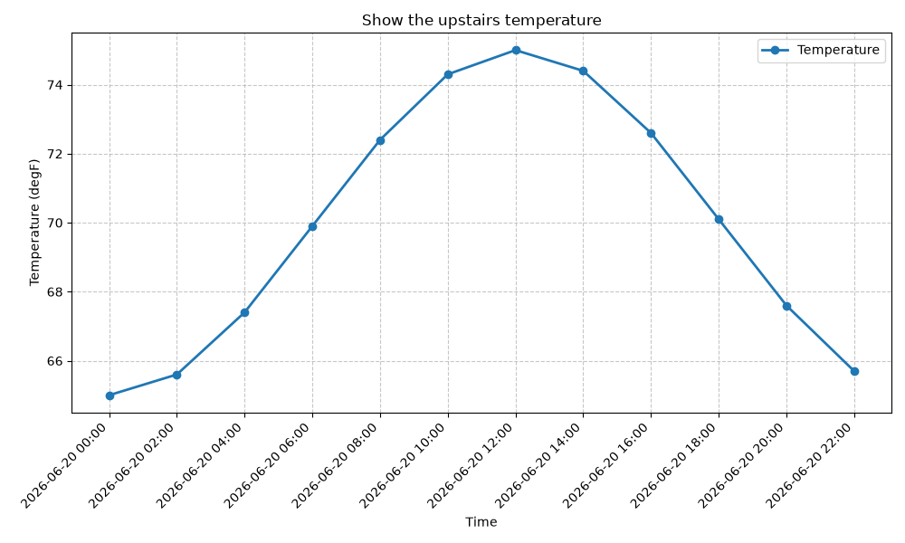 | **✓ accepted** · 21 loc 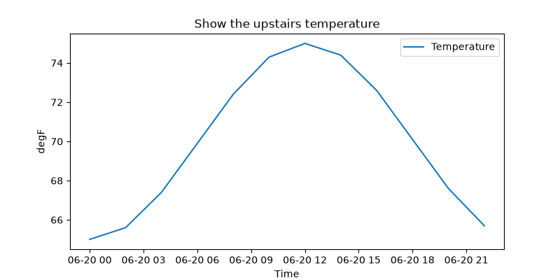 |

### `ts-02` — Show upstairs temperature for the last day

*category:* `single_numeric` · *expected family:* `time_series`

| `gemma4:e4b` | `qwen2.5-coder:7b` |
|---|---|
| **✓ accepted** · 82 loc 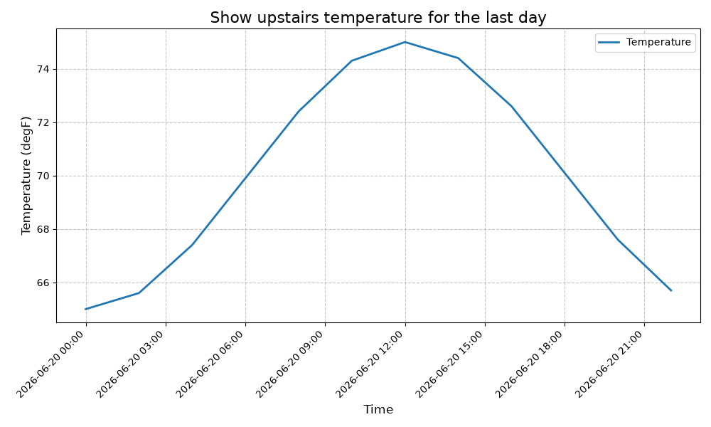 | **✓ accepted** · 23 loc 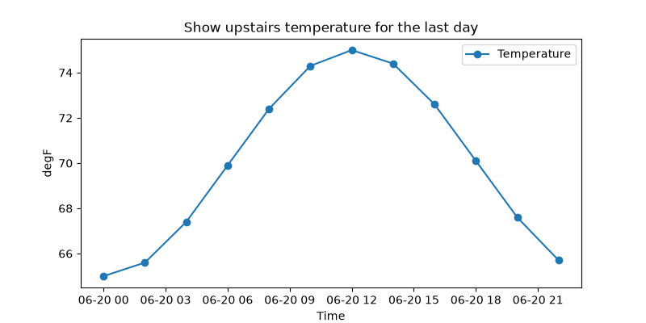 |

### `ts-03` — Show the bathroom temperature

*category:* `single_numeric` · *expected family:* `time_series`

| `gemma4:e4b` | `qwen2.5-coder:7b` |
|---|---|
| **✓ accepted** · 82 loc 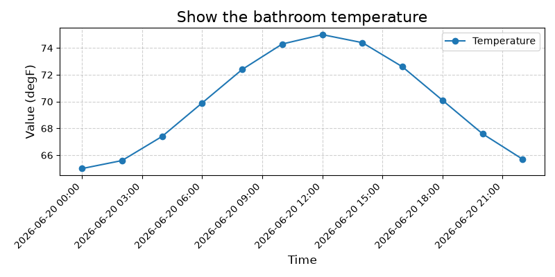 | **✓ accepted** · 21 loc  |

### `ts-04` — Show the family room temperature

*category:* `single_numeric` · *expected family:* `time_series`

| `gemma4:e4b` | `qwen2.5-coder:7b` |
|---|---|
| **✓ accepted** · 81 loc 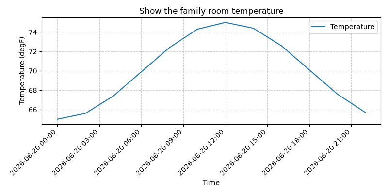 | **✓ accepted** · 21 loc 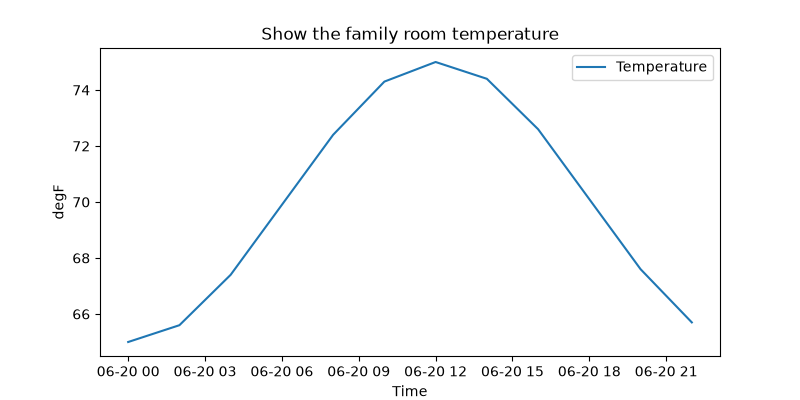 |

### `ts-05` — Show office temperature

*category:* `single_numeric` · *expected family:* `time_series`

| `gemma4:e4b` | `qwen2.5-coder:7b` |
|---|---|
| **✓ accepted** · 88 loc 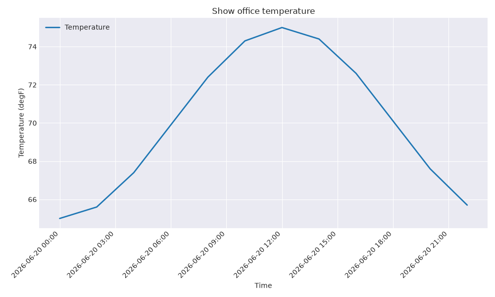 | **✓ accepted** · 21 loc 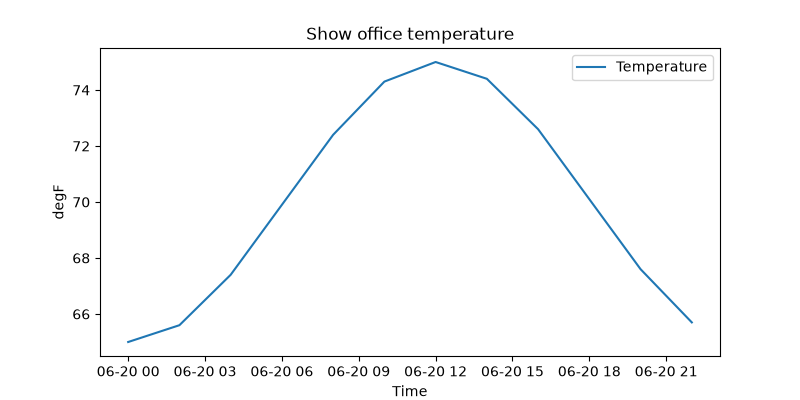 |

### `ts-06` — show kitchen temperature today

*category:* `single_numeric` · *expected family:* `time_series`

| `gemma4:e4b` | `qwen2.5-coder:7b` |
|---|---|
| **✓ accepted** · 97 loc 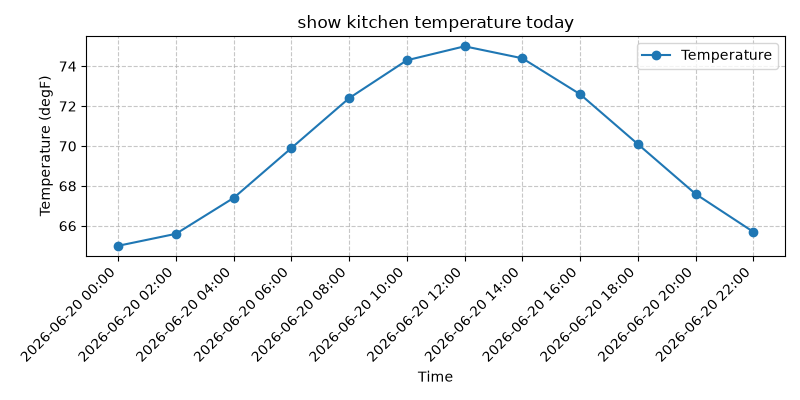 | **✓ accepted** · 21 loc  |

### `ts-07` — show humidity

*category:* `single_numeric` · *expected family:* `time_series`

| `gemma4:e4b` | `qwen2.5-coder:7b` |
|---|---|
| **✓ accepted** (after 1 repair) · 83 loc 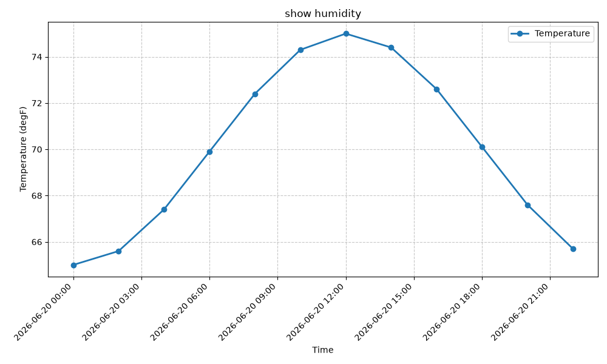 | **✓ accepted** · 23 loc 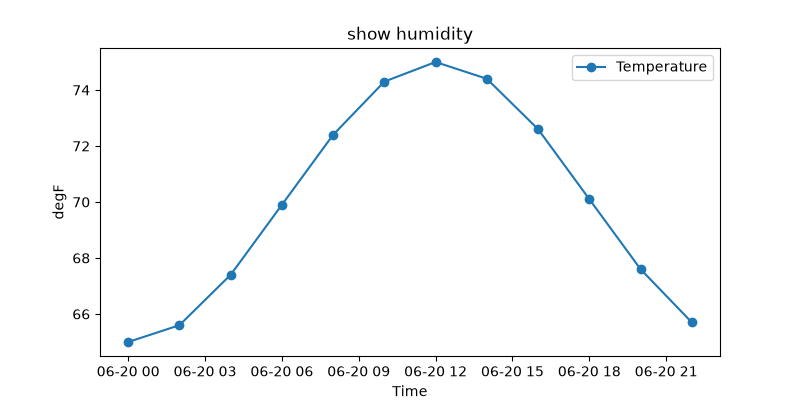 |

### `ts-08` — Show me the temperature over time

*category:* `single_numeric` · *expected family:* `time_series`

| `gemma4:e4b` | `qwen2.5-coder:7b` |
|---|---|
| **✓ accepted** · 89 loc 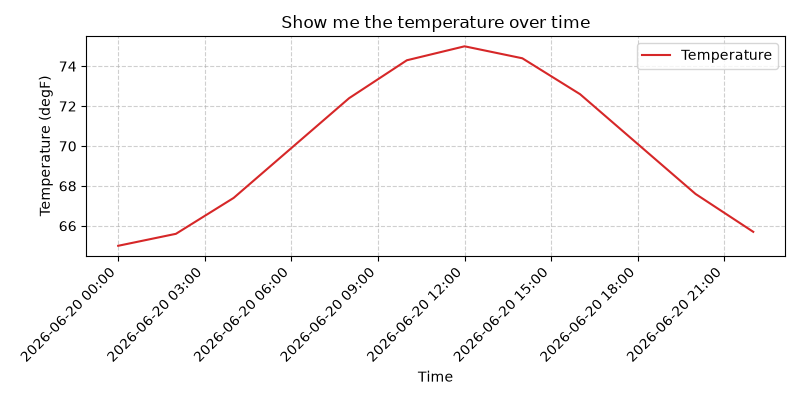 | **✓ accepted** · 23 loc  |

### `win-01` — show upstairs temperature overnight

*category:* `relative_window` · *expected family:* `time_series`

| `gemma4:e4b` | `qwen2.5-coder:7b` |
|---|---|
| **✓ accepted** · 83 loc 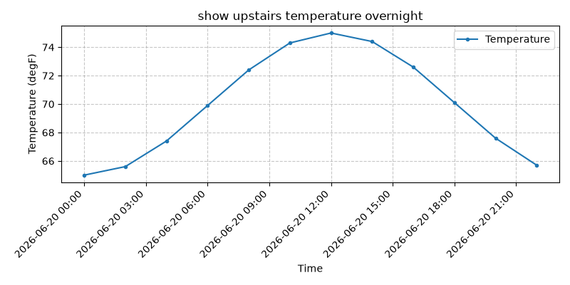 | **✓ accepted** · 21 loc  |

### `win-02` — attic temperature last weekend

*category:* `relative_window` · *expected family:* `time_series`

| `gemma4:e4b` | `qwen2.5-coder:7b` |
|---|---|
| **✓ accepted** · 84 loc 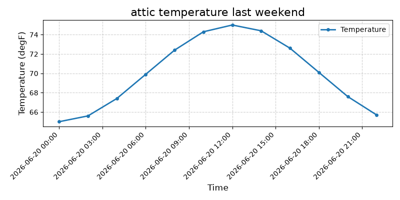 | **✓ accepted** · 21 loc  |

### `win-03` — Show me the attic temperature over the last 46 hours

*category:* `relative_window` · *expected family:* `time_series`

| `gemma4:e4b` | `qwen2.5-coder:7b` |
|---|---|
| **✓ accepted** · 89 loc 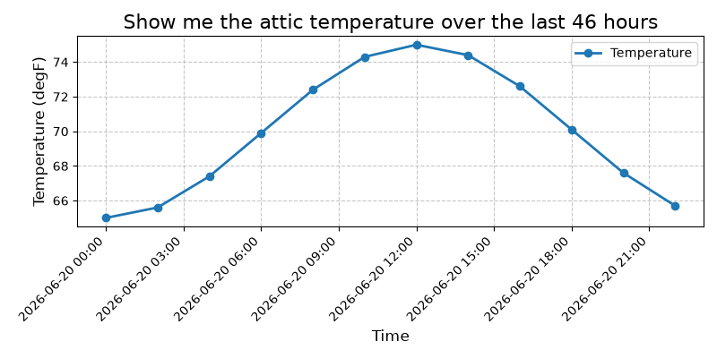 | **✓ accepted** · 23 loc 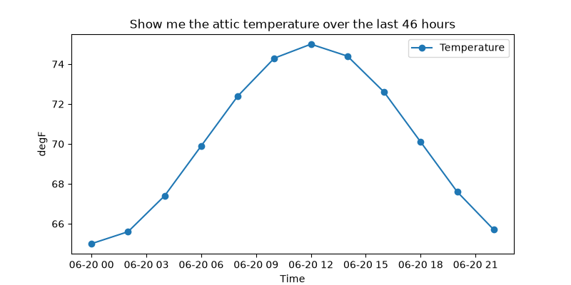 |

### `win-04` — show me the kitchen door state over the last four hours

*category:* `relative_window` · *expected family:* `timeline`

| `gemma4:e4b` | `qwen2.5-coder:7b` |
|---|---|
| **✓ accepted** · 95 loc 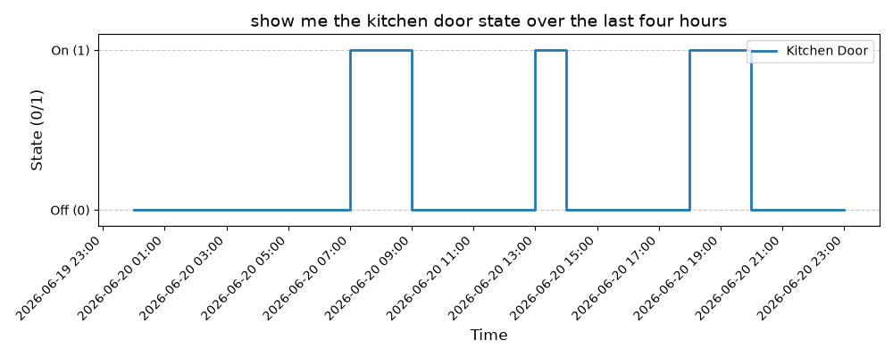 | **✓ accepted** · 23 loc 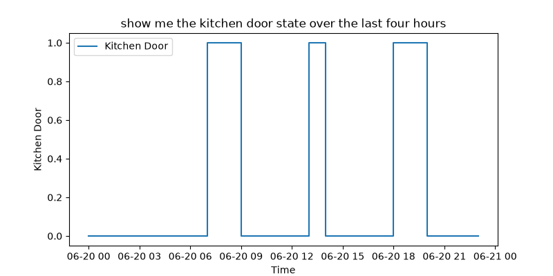 |

### `win-05` — show me the distribution of upstairs temperature this week

*category:* `relative_window` · *expected family:* `histogram`

| `gemma4:e4b` | `qwen2.5-coder:7b` |
|---|---|
| **✓ accepted** · 93 loc 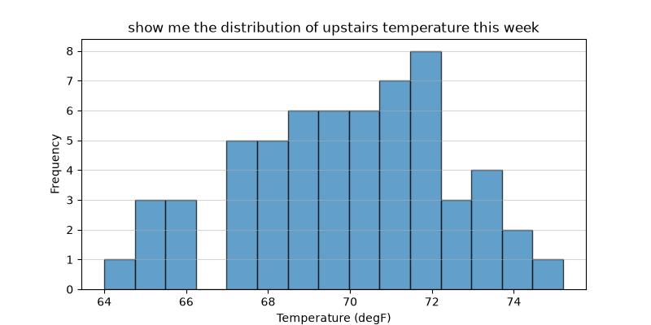 | **✓ accepted** · 19 loc 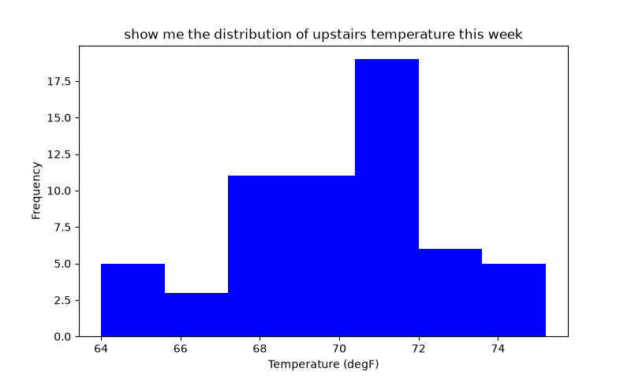 |

### `cmp-01` — Compare upstairs and downstairs temperatures

*category:* `multi_numeric` · *expected family:* `time_series`

| `gemma4:e4b` | `qwen2.5-coder:7b` |
|---|---|
| **✓ accepted** · 89 loc 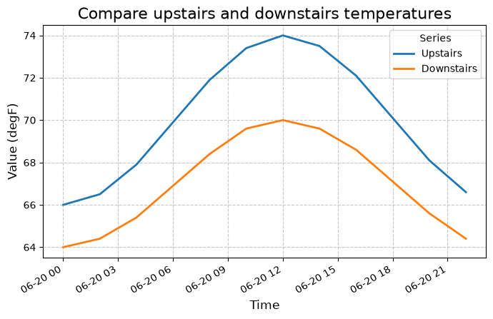 | **✓ accepted** (after 1 repair) · 26 loc 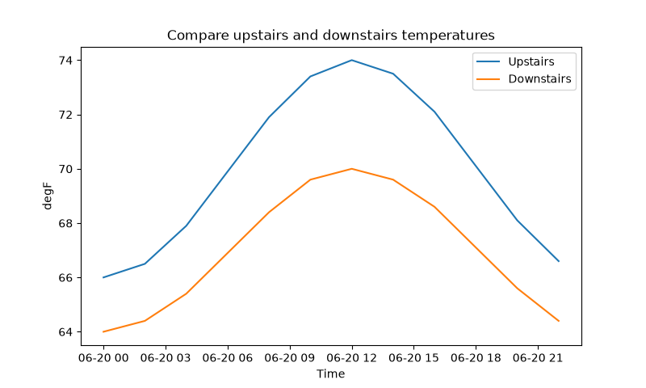 |

### `cmp-02` — Compare upstairs and downstairs temperatures over the last 24 hours

*category:* `multi_numeric` · *expected family:* `time_series`

| `gemma4:e4b` | `qwen2.5-coder:7b` |
|---|---|
| **✓ accepted** (after 1 repair) · 108 loc 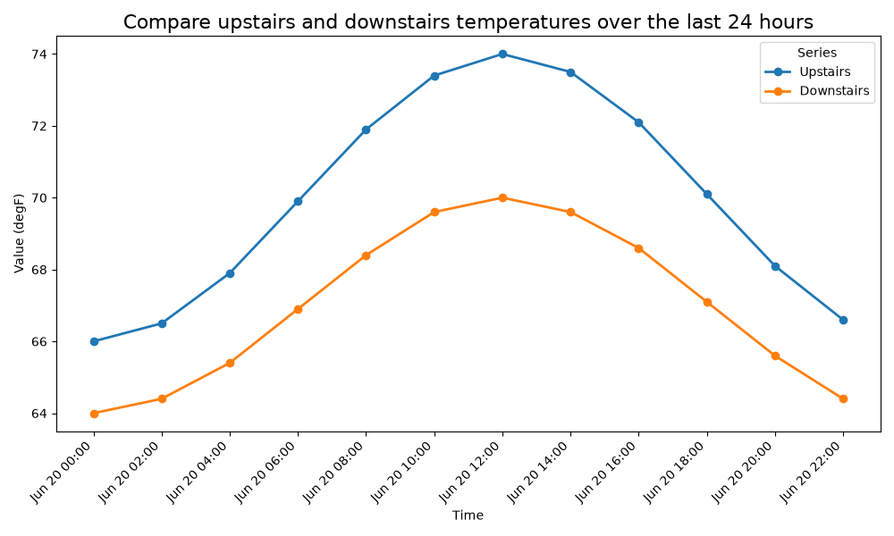 | **✓ accepted** (after 1 repair) · 26 loc 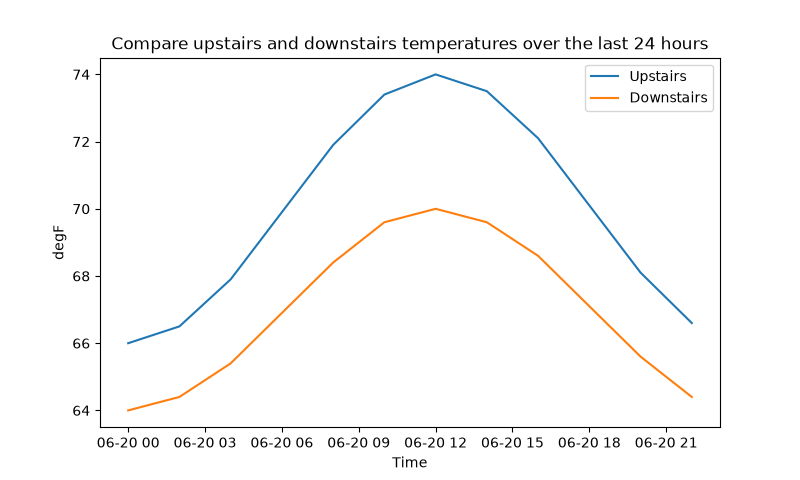 |

### `ov-01` — Show the family room temperature and when the AC was running

*category:* `numeric_binary_overlay` · *expected family:* `time_series_overlay`

| `gemma4:e4b` | `qwen2.5-coder:7b` |
|---|---|
| **✓ accepted** (after 2 repairs) · 93 loc 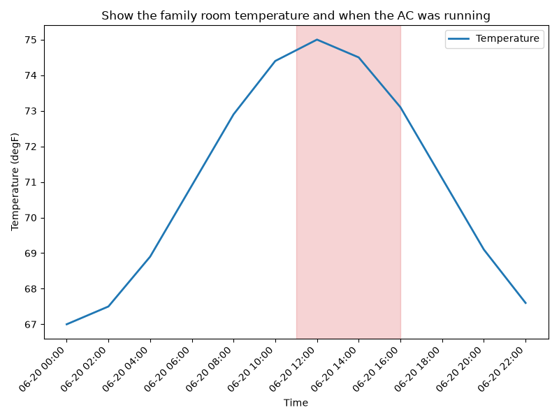 | **✓ accepted** · 35 loc 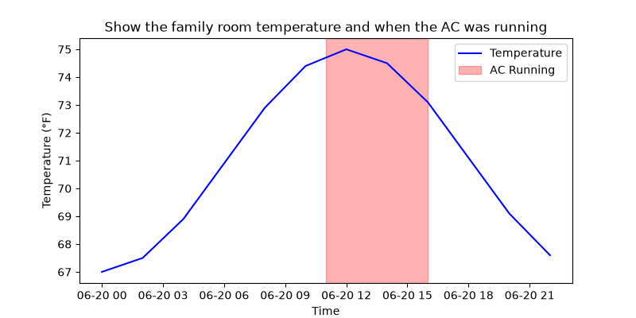 |

### `ov-02` — show kitchen temp and when the AC was running

*category:* `numeric_binary_overlay` · *expected family:* `time_series_overlay` · *note:* Historically triggered entity-selection over-composition ('kitchen' noise-matched the ecobee temp sensor); fixed by ADR-0028 model-validated composition prune.

| `gemma4:e4b` | `qwen2.5-coder:7b` |
|---|---|
| **✗ rejected** (after 1 repair attempts) `unsafe_code` | **✓ accepted** · 35 loc 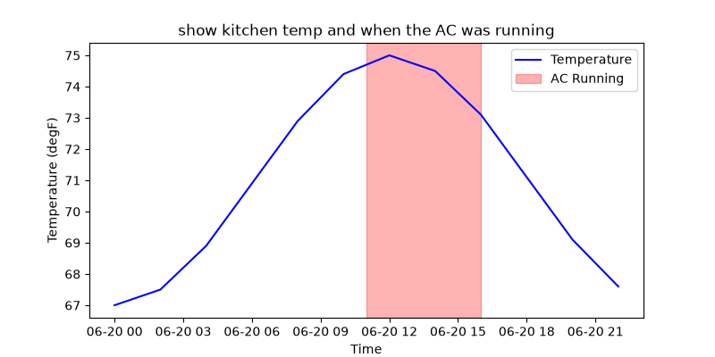 |

### `ov-03` — show me the temperature and when the AC was running

*category:* `numeric_binary_overlay` · *expected family:* `time_series_overlay`

| `gemma4:e4b` | `qwen2.5-coder:7b` |
|---|---|
| **✓ accepted** · 90 loc 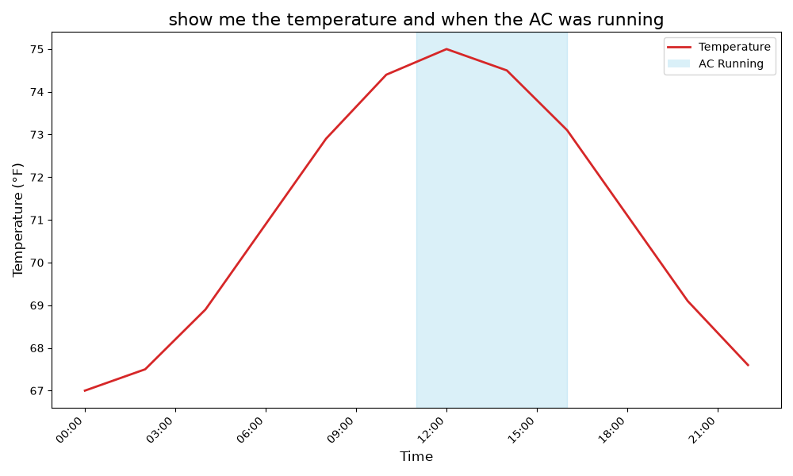 | **✗ rejected** (after 2 repair attempts) `runtime_error` — TypeError: ufunc 'isfinite' not supported for the input types, and the inputs could not be safely coerced to any support |

### `ov-04` — show me maren's room temperature and when the AC was running

*category:* `numeric_binary_overlay` · *expected family:* `time_series_overlay` · *note:* 'AC' has no token overlap with the ecobee entity name; historically needed D2 expansion / semantic alias (ADR-0024).

| `gemma4:e4b` | `qwen2.5-coder:7b` |
|---|---|
| **✓ accepted** · 84 loc 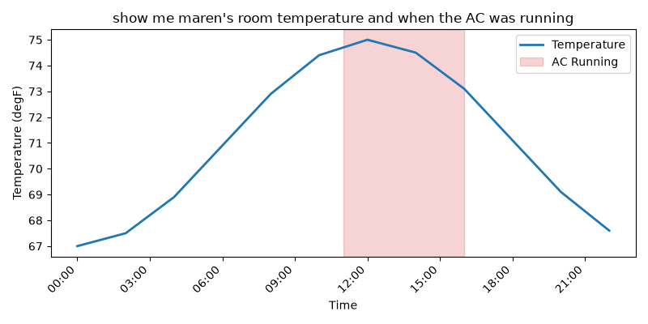 | **✗ rejected** (after 2 repair attempts) `runtime_error` — TypeError: ufunc 'isfinite' not supported for the input types, and the inputs could not be safely coerced to any support |

### `ov-05` — show me the kitchen temperature yesterday and when the kitchen door was open

*category:* `numeric_binary_overlay` · *expected family:* `time_series_overlay`

| `gemma4:e4b` | `qwen2.5-coder:7b` |
|---|---|
| **✓ accepted** · 102 loc 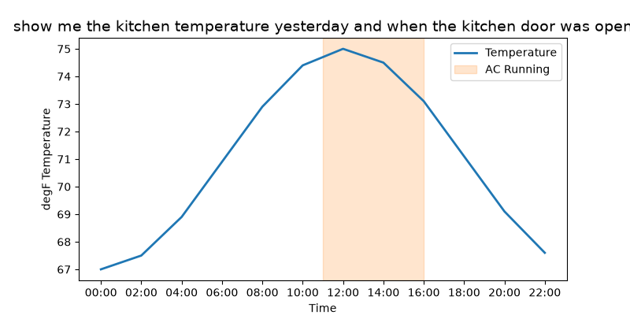 | **✓ accepted** · 24 loc 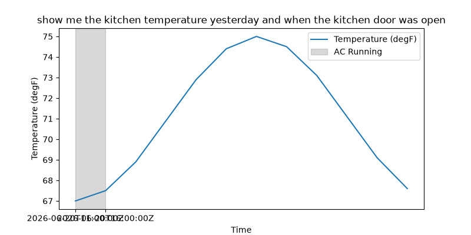 |

### `ov-06` — kitchen temperature and the front door

*category:* `numeric_binary_overlay` · *expected family:* `time_series_overlay`

| `gemma4:e4b` | `qwen2.5-coder:7b` |
|---|---|
| **✓ accepted** · 99 loc 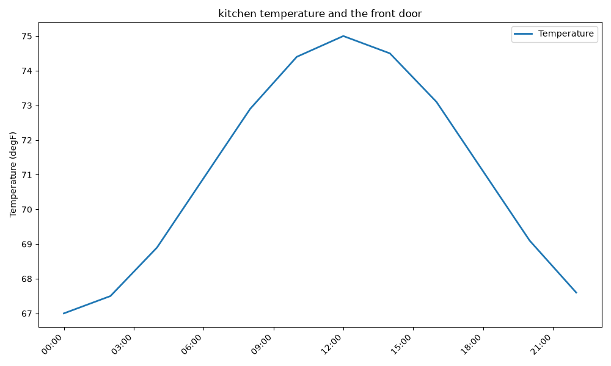 | **✓ accepted** (after 1 repair) · 26 loc 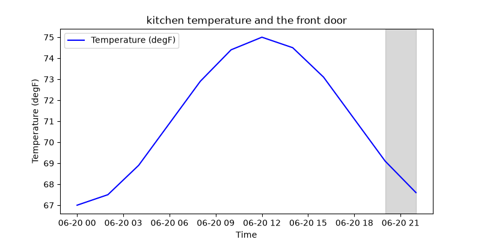 |

### `tl-01` — when was the kitchen door open today

*category:* `binary_timeline` · *expected family:* `timeline` · *note:* Historically failed via over-composition with a temp sensor; ADR-0028.

| `gemma4:e4b` | `qwen2.5-coder:7b` |
|---|---|
| **✓ accepted** · 105 loc 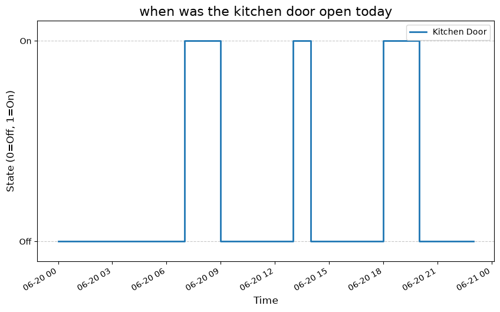 | **✓ accepted** · 23 loc 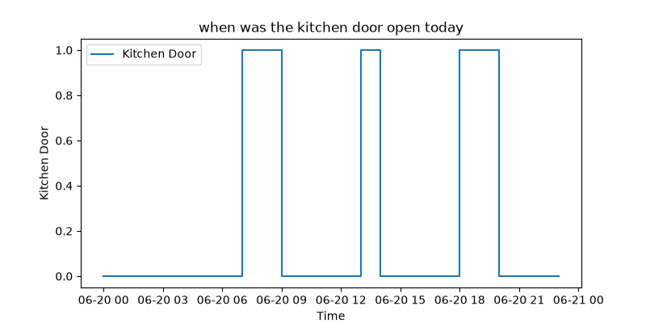 |

### `tl-02` — show me when the kitchen door was open this morning

*category:* `binary_timeline` · *expected family:* `timeline`

| `gemma4:e4b` | `qwen2.5-coder:7b` |
|---|---|
| **✓ accepted** · 93 loc 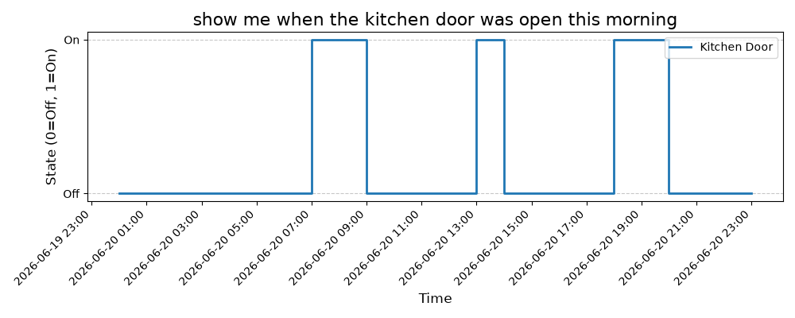 | **✓ accepted** · 20 loc 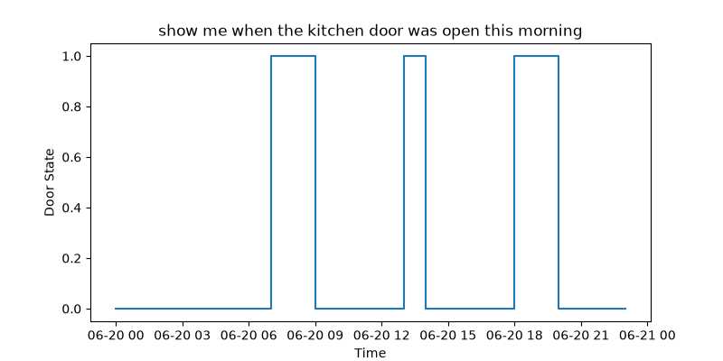 |

### `tl-03` — Mark when the dishwasher was running over the last day

*category:* `binary_timeline` · *expected family:* `timeline`

| `gemma4:e4b` | `qwen2.5-coder:7b` |
|---|---|
| **✓ accepted** · 90 loc 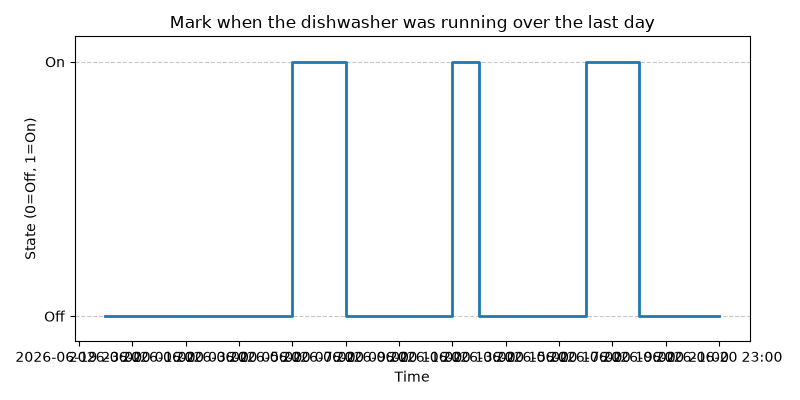 | **✓ accepted** · 23 loc 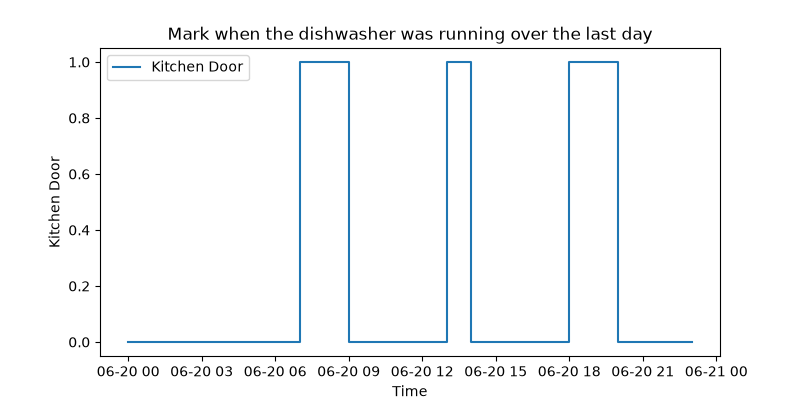 |

### `tl-04` — when was the air conditioning on

*category:* `binary_timeline` · *expected family:* `timeline`

| `gemma4:e4b` | `qwen2.5-coder:7b` |
|---|---|
| **✓ accepted** · 102 loc 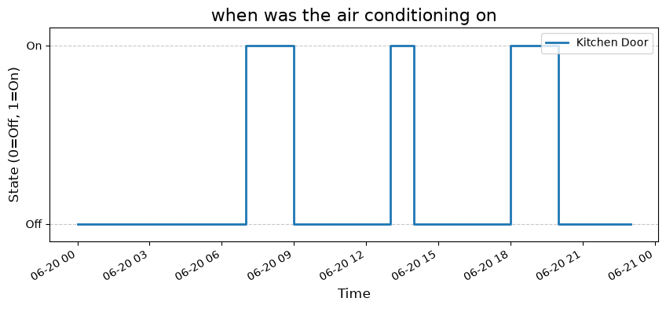 | **✓ accepted** · 23 loc  |

### `tl-05` — show me the air conditioning

*category:* `binary_timeline` · *expected family:* `timeline` · *note:* Terse; a climate/binary entity, no explicit metric.

| `gemma4:e4b` | `qwen2.5-coder:7b` |
|---|---|
| **✓ accepted** · 99 loc 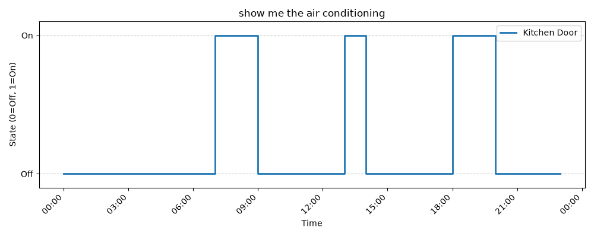 | **✓ accepted** · 23 loc 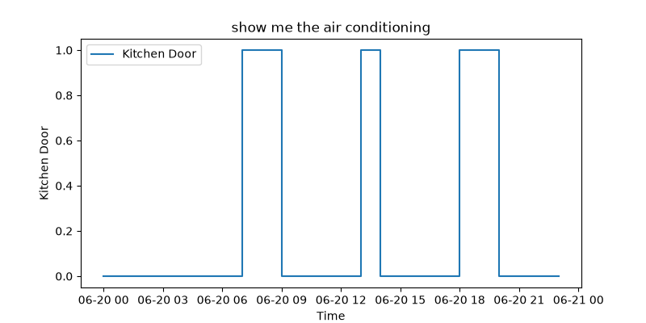 |

### `dist-01` — show the distribution of bathroom temp

*category:* `distribution_histogram` · *expected family:* `histogram`

| `gemma4:e4b` | `qwen2.5-coder:7b` |
|---|---|
| **✓ accepted** · 48 loc 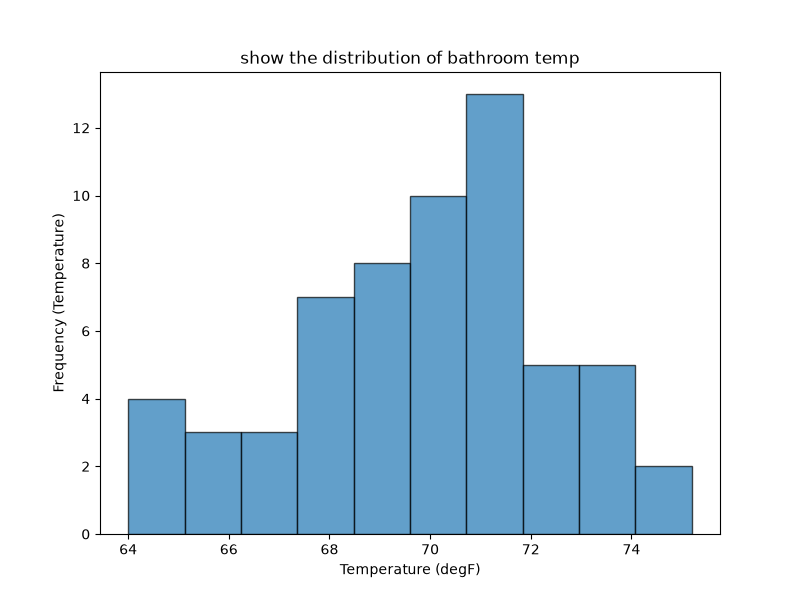 | **✓ accepted** · 19 loc  |

### `dist-02` — show distribution of upstairs temp

*category:* `distribution_histogram` · *expected family:* `histogram`

| `gemma4:e4b` | `qwen2.5-coder:7b` |
|---|---|
| **✓ accepted** · 56 loc  | **✓ accepted** · 19 loc  |

### `agg-01` — what's the average temperature per day

*category:* `aggregate_bar` · *expected family:* `aggregate_bar`

| `gemma4:e4b` | `qwen2.5-coder:7b` |
|---|---|
| **✓ accepted** · 90 loc 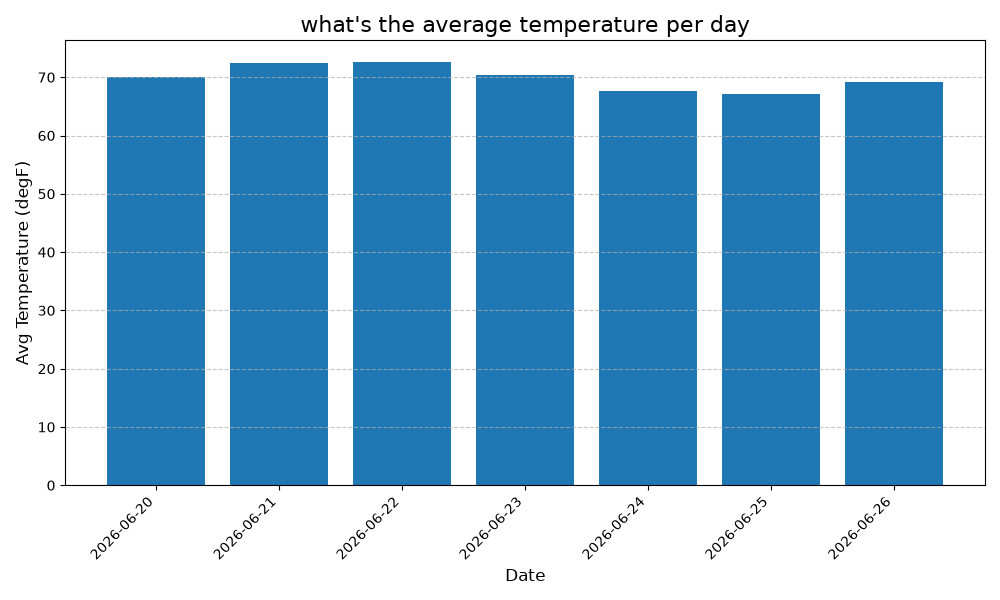 | **✓ accepted** · 21 loc  |

### `agg-02` — what's the average upstairs temperature per day

*category:* `aggregate_bar` · *expected family:* `aggregate_bar`

| `gemma4:e4b` | `qwen2.5-coder:7b` |
|---|---|
| **✓ accepted** · 94 loc 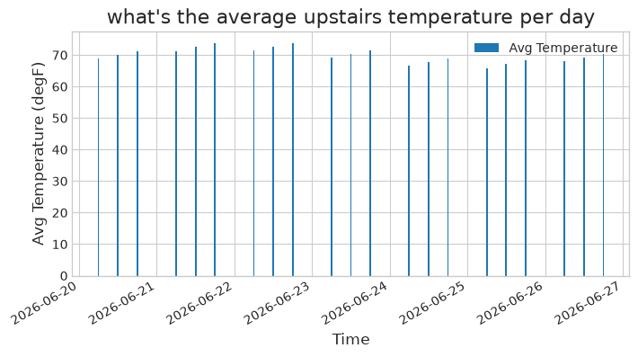 | **✓ accepted** · 22 loc 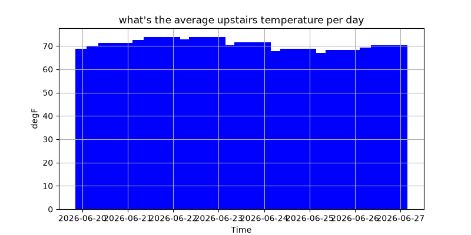 |

### `agg-03` — family room average temperature per day

*category:* `aggregate_bar` · *expected family:* `aggregate_bar`

| `gemma4:e4b` | `qwen2.5-coder:7b` |
|---|---|
| **✗ rejected** (after 2 repair attempts) `output_missing` | **✓ accepted** · 20 loc 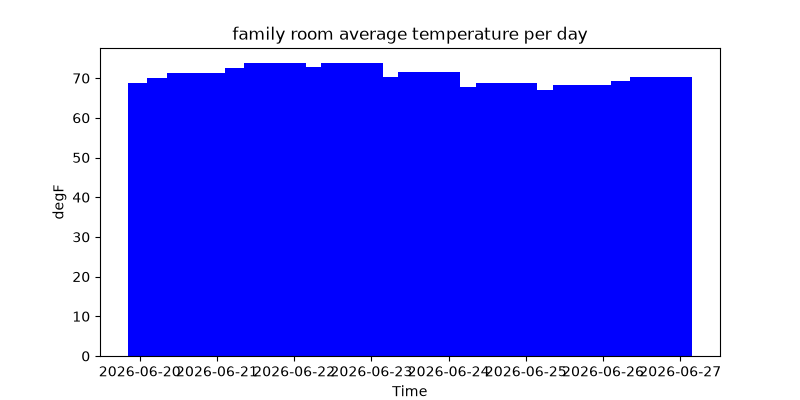 |

### `eid-01` — Show sensor.upstairs_temperature for the last 24 hours

*category:* `explicit_entity_id` · *expected family:* `time_series`

| `gemma4:e4b` | `qwen2.5-coder:7b` |
|---|---|
| **✓ accepted** · 70 loc 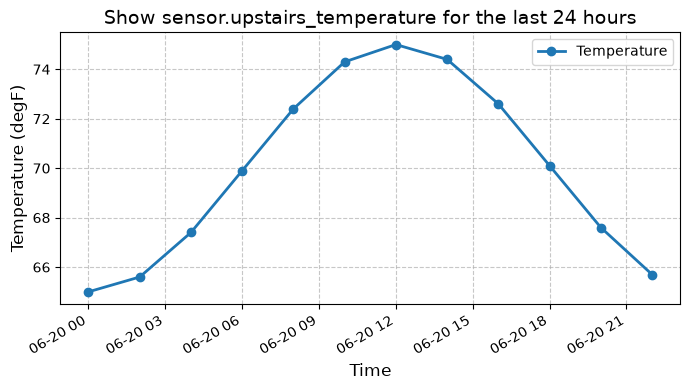 | **✓ accepted** · 25 loc 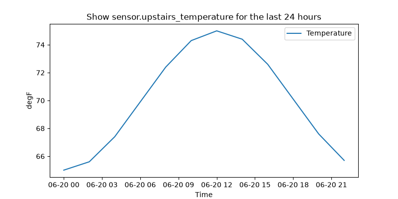 |

### `eid-02` — Show sensor.family_room_sensor_temperature

*category:* `explicit_entity_id` · *expected family:* `time_series`

| `gemma4:e4b` | `qwen2.5-coder:7b` |
|---|---|
| **✓ accepted** · 84 loc 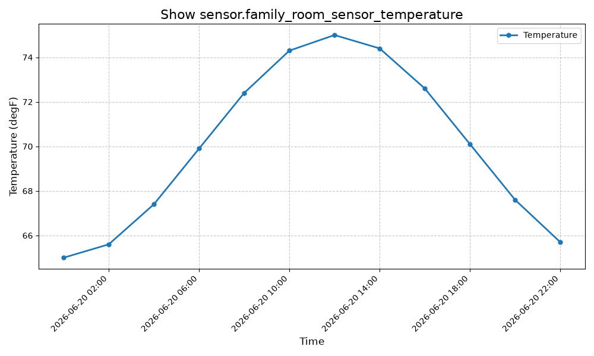 | **✓ accepted** · 21 loc 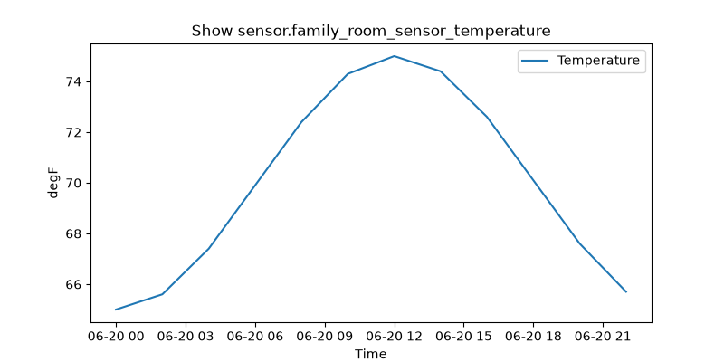 |

### `eid-03` — Show binary_sensor.kitchen_door for the last 24 hours

*category:* `explicit_entity_id` · *expected family:* `timeline`

| `gemma4:e4b` | `qwen2.5-coder:7b` |
|---|---|
| **✓ accepted** · 104 loc 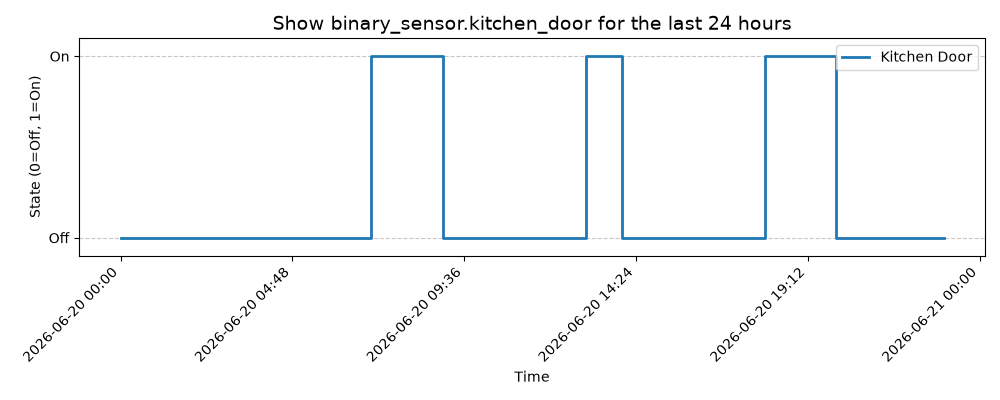 | **✓ accepted** · 20 loc 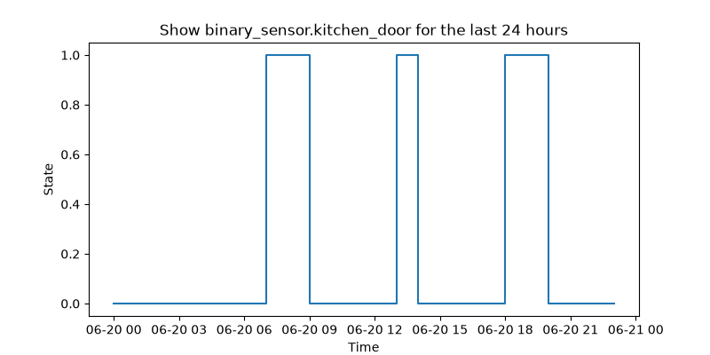 |

### `eid-04` — Show sensor.upstairs_temperature binary_sensor.kitchen_door for the last 24 hours

*category:* `explicit_entity_id` · *expected family:* `time_series_overlay`

| `gemma4:e4b` | `qwen2.5-coder:7b` |
|---|---|
| **✓ accepted** · 108 loc 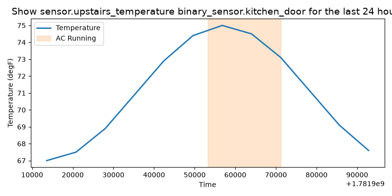 | **✓ accepted** · 24 loc 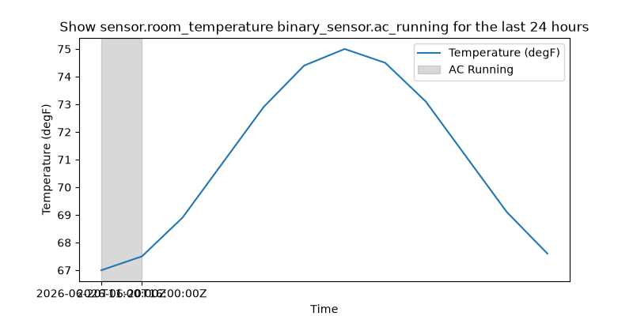 |

### `amb-01` — upstairs temperature

*category:* `ambiguous_clarification` · *expected family:* `clarification` · *note:* Three upstairs temperature sensors -> planner asks 'Should I average them and call that upstairs temperature?' (invariant #1).

_Not a codegen case — expected planner behavior: **clarification** (clarify/refuse/unsupported), so no chart is generated._

### `amb-02` — Show the temperature

*category:* `ambiguous_clarification` · *expected family:* `clarification` · *note:* Which temperature entity? Depends on the configured allowlist.

_Not a codegen case — expected planner behavior: **clarification** (clarify/refuse/unsupported), so no chart is generated._

### `amb-03` — show thermostat history

*category:* `ambiguous_clarification` · *expected family:* `clarification` · *note:* Underspecified; thermostat exposes multiple attributes/entities.

_Not a codegen case — expected planner behavior: **clarification** (clarify/refuse/unsupported), so no chart is generated._

### `alias-01` — Use and remember as upstairs temperature

*category:* `semantic_alias` · *expected family:* `—` · *note:* Follow-up to an entity clarification; a reworded prompt should then skip clarification.

_Not a codegen case — expected planner behavior: **save SemanticAlias on clarification answer (ADR-0009, Tranche 2)** (clarify/refuse/unsupported), so no chart is generated._

### `neg-01` — Turn on the kitchen lights

*category:* `out_of_scope_refuse` · *expected family:* `refuse` · *note:* Mutation request; the read-only MVP must not act (invariant #2).

_Not a codegen case — expected planner behavior: **refuse** (clarify/refuse/unsupported), so no chart is generated._

### `neg-02` — Show light.kitchen compared with the approved climate sensor

*category:* `out_of_scope_refuse` · *expected family:* `clarification` · *note:* Mixes a non-charted/likely-unapproved entity with an approved one; allowlist boundary applies (invariant #1).

_Not a codegen case — expected planner behavior: **clarification** (clarify/refuse/unsupported), so no chart is generated._

### `neg-03` — Render unsupported energy histogram

*category:* `unsupported` · *expected family:* `—`

_Not a codegen case — expected planner behavior: **fail closed with a clear unsupported result, not a bad render** (clarify/refuse/unsupported), so no chart is generated._
